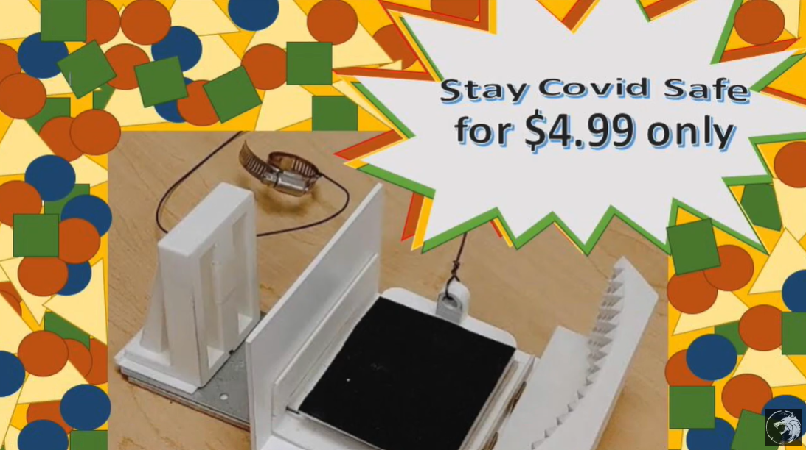

# Foot-Pedal-Covid-19-Design-Project-
Product design group project to address covid-19 
This is the final design project named the "Door Buster" for the APSC 171 Engineering Drawing and CAD/CAM class.

The requirements of the project were to build a product, comprised of as many parts as group members, that attempts to address any issue related to the covid-19 pandemic.
This repository contains the drawings of the pieces of the project as well as a [youtube link](https://www.youtube.com/watch?v=xa9GExP3DIY) where the purpose of the project is discussed and the final 3d printed product can be appreciated.

